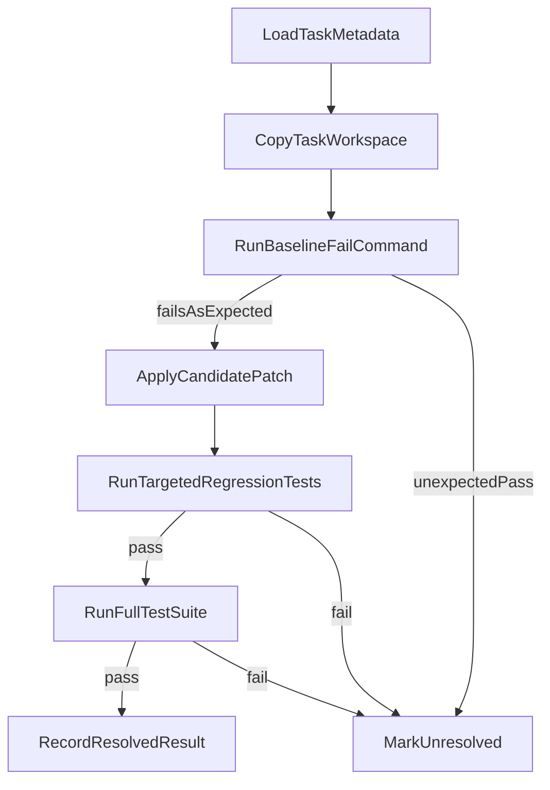

# SWE-Bench Mini

`swe-bench-mini` is a compact benchmark repository for comparing bug-fixing systems on 15 small, behavior-validated debugging tasks. Each system submits a patch against a task workspace, and the harness only awards credit when the original bug is reproduced first and the patched workspace then passes both the targeted regression and the full task test suite.

## Status

This repository currently contains the top-level scaffold, the canonical task schema, and the directory layout for the benchmark. The harness implementation and the 15 benchmark tasks are expected to be added on top of this scaffold.

## Systems Under Comparison

The benchmark is designed to evaluate these systems uniformly:

- `small-only`
- `big-only`
- `small-big`
- `minions`

Each system should emit the same final artifact format: a unified diff patch against the copied task workspace.

## Repository Layout

```text
.
|-- README.md
|-- harness/
|-- results/
`-- tasks/
    `-- task_schema.json
```

The completed benchmark will keep exactly 15 task directories under `tasks/`, named `task_01_*` through `task_15_*`.

Each task directory should follow this contract:

```text
tasks/task_XX_slug/
|-- task.json
|-- metadata.json
|-- context/
|-- tests/
|   `-- run_tests.sh
`-- gold/
```

## Task Schema

The canonical task schema lives at `tasks/task_schema.json`.

Each `task.json` must include:

- `task_id`
- `title`
- `difficulty`
- `tags`
- `entry_point` or `editable_paths`
- `setup_command`
- `baseline_fail_command`
- `candidate_test_command`
- `full_test_command`
- `timeout_seconds`
- `forbidden_paths`

Required invariants for every task:

- The buggy snapshot must fail at least one declared regression test.
- The gold fix must pass the targeted regression and the full suite.
- Candidate systems are scored on behavior, not textual similarity to the gold fix.
- `tests/`, `gold/`, `metadata.json`, and `task.json` remain immutable during evaluation.

## Harness Responsibilities

The planned harness modules under `harness/` are:

- `load_task.py`: load and validate task metadata against `tasks/task_schema.json`
- `apply_patch.py`: apply candidate patches and reject forbidden edits
- `run_task.py`: run one task end to end in an isolated temporary workspace
- `run_suite.py`: execute all 15 tasks for one or more systems
- `score.py`: aggregate per-task results into benchmark summaries

Per-task execution should follow this flow:

1. Copy `context/` and `tests/` into a fresh temporary workspace.
2. Run `baseline_fail_command` and require it to fail.
3. Apply the candidate patch.
4. Reject malformed patches, failed applies, and forbidden edits immediately.
5. Run `candidate_test_command` and require it to pass.
6. Run `full_test_command` and require it to pass.
7. Save a structured result JSON under `results/`.



## Result Semantics

Each `(system, task)` result should record at least:

- `task_id`
- `system`
- `patch_applied`
- `baseline_failed`
- `targeted_tests_passed`
- `full_suite_passed`
- `forbidden_edit`
- `resolved`
- `runtime_sec`
- `error_type`

`resolved` is `true` only when all of the following are true:

- baseline failure was confirmed
- the candidate patch applied cleanly
- no forbidden files were edited
- targeted regression tests passed
- the full suite passed

`resolved_rate` should remain the primary leaderboard metric.

## Running The Benchmark

The harness commands below are placeholders until the Python runner is implemented:

- Run one task locally: `python -m harness.run_task --task-id task_01_example --system small-only --patch path/to.patch`
- Run the full benchmark for one system: `python -m harness.run_suite --system small-only`
- Summarize results: `python -m harness.score --results-dir results`

## Authoring Rules

When adding or replacing tasks, preserve these rules:

- Keep exactly 15 task directories in `tasks/`.
- Use the shared task contract and validate `task.json` against `tasks/task_schema.json`.
- Keep the buggy state small, local, and behaviorally testable.
- Ensure the regression test fails before patching and passes after the gold fix.
- Do not score candidates by comparing their diff to `gold/`.
